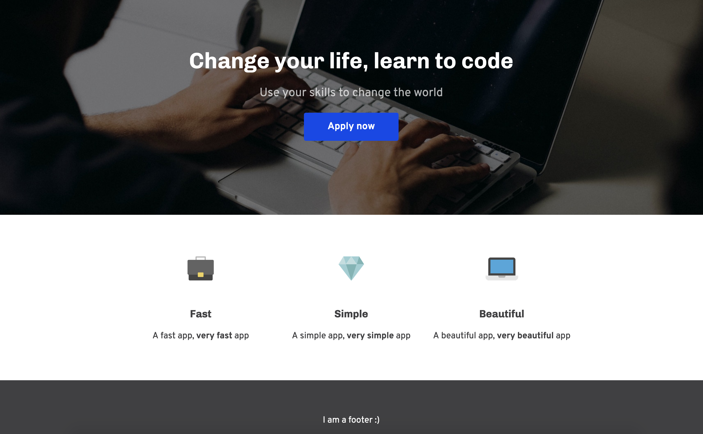

## Background & Objectives

A good enough challenge to manipulate both HTML tags and css classes and create a landing page with a headline, a call to action link, images (normal use and as background), use a grid (flex or grid), etc.

## Specs

Build a page matching the following screenshot:

You can also see the end result [here](https://oussa.github.io/html-css-challenges/challenge3/solution/).
