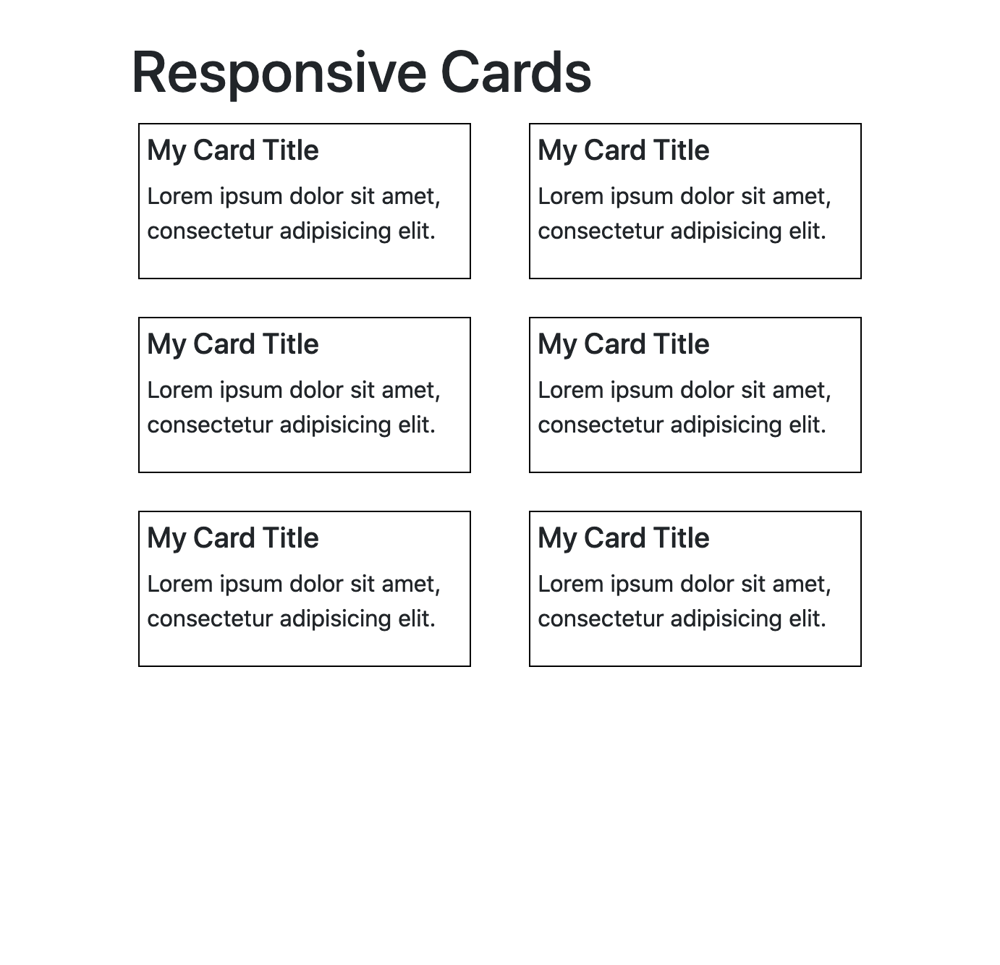

# Responsive Layout

## Background & Objectives

The aim of this simple challenge is to create a responsive layout for cards.

## Specs

We want our cards to display as 1 single card per row on super small devices. We want to have 2 cards next to each other on small devices.
We want to have 3 cards per row on tablet, and 4 cards per row on extra large desktops.

Basically depending on the width of the device, the result should match the following screenshots:

| xs device                    | sm device                   | md device                   | lg device                   | xl device                   |
|:----------------------------:|:---------------------------:|:---------------------------:|:---------------------------:| :--------------------------:|
| |||||
| 1 card per row               | 2 cards per row             | 3 cards per row             | 3 cards per row             | 4 cards per row             |

You can also see the end result [here](https://oussa.github.io/html-css-challenges/challenge4/solution/).

## Tips & Resources

- You can use [Bootstrap Grid](https://getbootstrap.com/docs/4.0/layout/grid/) to build the layout for the different sizes.
  - Hint: To include the library in the page, look for `Bootstrap CDN` on Google and copy the css file's url to your `<link rel="stylesheet" href="...` tag.
